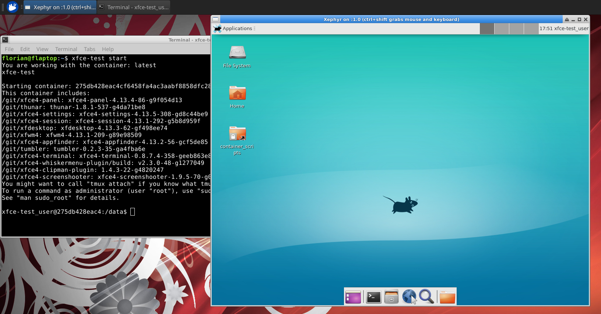

# XFCE Test



XFCE Test is a setup of a Dockercontainer with [Behave](https://github.com/behave/behave) tests and an interactive bash helper `xfce-test`.
The main usecases are:

 * Creation of automatic Demo tours (MP4 videos) of XFCE applications
 * Fully automatic GUI tests
   (which can be "documented" also by creation of a video)
 * Great support for translators by searching and highlighting of
   translation artefacts and highlighting them within a scenario
   (this functionality is not yet usable)

The automatically created videos are on [my youtube channel](https://www.youtube.com/user/schuellerf) for now.

This is a Xubuntu 18.10, with a build from git sources of all core Xfce components + some apps for testing.
Other distributions and versions are on other branches!

# Travis

The tests are run automatically by [travis](https://travis-ci.org/schuellerf/xfce-test).

:white_check_mark: Those test are usually errored or failed as we are building _master_ of the xfce repositories. A more stable branch will follow.

[](https://travis-ci.org/schuellerf/xfce-test)

# Architecture

This test is set-up as a docker container which is displaying it's X11 content on a Xephyr instance on your screen.

The first process to be started is [LDTP](https://ldtp.freedesktop.org/wiki/)
As "toolkit-accessibility" is activated (see Dockerfile) LDTP provides an XMLRPC port to run automated tests.

On top of LDTP there is [Behave](https://github.com/behave/behave) running a series of tests.

You can also just start the container and "play around" in the newest XFCE environment...
```
xfce-test start
```

# Preparations

either "read" the `xfce-test` script :) or at least assure docker and Xephyr to be on-board

For ubuntu those prerequisites are automatically installed by `xfce-test`

# Installation

There is no direct _need_ to install XFCE Test but for convenience you can install the script and the bash autocompletion functions with `./xfce-test install`

If you did not clone all the source code of xfce-test already you can boot-strap easily with:
```
curl --fail --location -o /tmp/xfce-test https://github.com/schuellerf/xfce-test/raw/master/xfce-test && chmod u+x /tmp/xfce-test && /tmp/xfce-test install
```

# Usage

Just start `xfce-test` to get an interactive menu for possible options or call `xfce-test --help`

To see the container in action and play around with the "master" versions of XFCE applications just run `xfce-test pull` to get the current container and `xfce-test start` to start the container.

# Tests

To inspect stuff inside the docker to help create more tests you might want to start `sniff` which will help you identify the windows and buttons for LDTP.

# Building

You don't need to build the container you can just pull one to work with. If you really want to build the container locally you can just call

```
xfce-test build
```

If you have enough RAM, let's say more than 10G, you can build all components in parallel like so:

```
LOG=build.log PARALLEL_BUILDS=8 ./xfce-test build
```

This drastically reduces the container build time.

# Normal Test

When you want to make screenshots for each behave test step just set the variable `SCREENSHOTS` to `ALWAYS`

```
export SCREENSHOTS=ALWAYS
```

then run your behave tests

# Translation Assistance

TBD ...

TRANSLATION_LANG
VIDEO_FILE

# Package compilation

You can also use this container as test and compilation environment. The directory you are currently in, is automatically mounted to `/data` in the container.

All the default build options which are used by the container are available as `AUTOGEN_OPTIONS` environment variable *in the container*.
So when you started the container with `xfce-test start` or `xfce-test no-session` you can use those options for example by calling `./autogen.sh $AUTOGEN_OPTIONS` in the application.

## Sources
As the applications of the container are built from source _all_ developer packages and many developer tools are pre-installed. Also the sourcecode is available in the folder `/git` within the container

## Examples
An advanced example if you want to check a command in all docker images you have locally:
```
xfce-test list_local|xargs -n1 -I XYZ bash -c "TAG=XYZ xfce-test call apt search gtk-3-dev 2>&1 | egrep gtk-3\|working ; echo '----' "
```

This results in:
```
You are working with the container: latest
libgtk-3-dev/now 3.24.12-1ubuntu1 amd64 [installed,local]
----
You are working with the container: ubuntu_19.04
libgtk-3-dev/now 3.24.8-1ubuntu1 amd64 [installed,local]
----
You are working with the container: audio_test
libgtk-3-dev/now 3.24.8-1ubuntu1 amd64 [installed,local]
----
You are working with the container: ubuntu_18.04
libgtk-3-dev/now 3.22.30-1ubuntu4 amd64 [installed,local]
---- 
```
